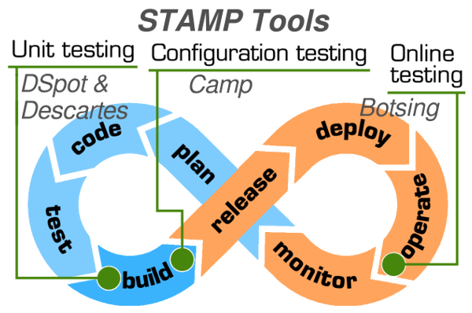

## STAMP introduction ##
##### [Documentation](#documentation-and-general-discussions) | [Tools](#stamp-tools) | [More](#more) #####
STAMP-project contains a lot of repositories for tools, documentation and experiments,
and we hope this introduction will help you to find what you are looking for. :-)

#### Documentation and general discussions ####
The entry point is [docs-forum](http://github.com/STAMP-project/docs-forum) where you can find
[STAMP public deliverables](docs), general documentation and [general discussions](https://github.com/STAMP-project/docs-forum/issues).  
STAMP-project contains several technical repositories, corresponding to tools you
can use. We use Issues of each repository to manage the
development and the technical support on the corresponding tool (defects, improvement,
change requests, etc).  
And so **docs-forum** is dedicated to more general discussion about the project,
technologies relative to the project, feedback, etc.

# STAMP - Software Testing AMPlification #
The main STAMP tools are presented in the following map:  
  
You can find them all on our github:  
* [DSpot](http://github.com/STAMP-project/dspot)
* [Descartes](http://github.com/STAMP-project/pitest-descartes)
* [Camp](http://github.com/STAMP-project/camp)
* [Botsing](http://github.com/STAMP-project/botsing)

#### More ####
Do you want to be kept informed on STAMP tools ? Watch our repositories ! ;-)  
You can also consult our web-site: [www.stamp-project.eu](http://www.stamp-project.eu)  
And if you need help or information, please ask us ! :-)
